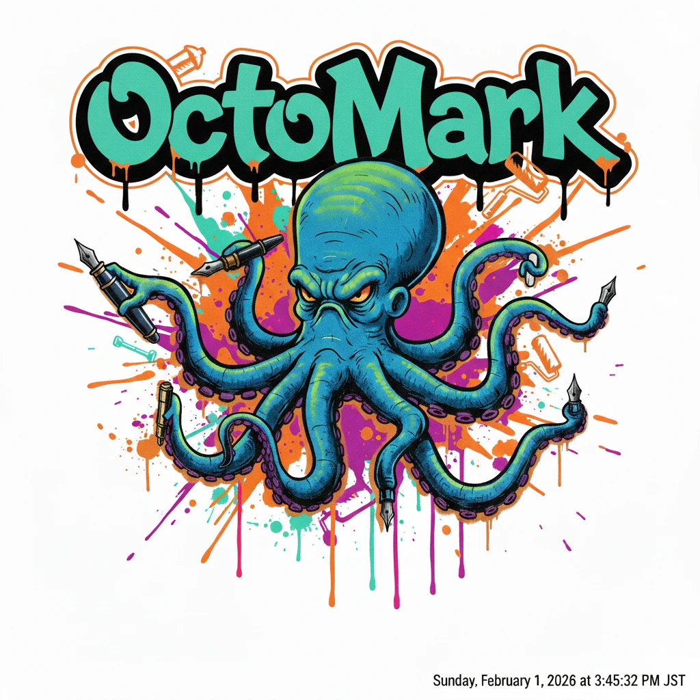

# OctoMark

<p align="center">
  
</p>

OctoMark is an ultra-high performance, streaming Markdown parser written in pure C99. It is designed for environments where parsing speed and memory efficiency are critical, such as real-time editors, high-traffic servers, or resource-constrained systems.

## Key Features

- **Extreme Performance**: Sustained throughput depends on input; see the benchmark section for local measurement.
- **Pure C99**: No external dependencies beyond the C standard library. Highly portable.
- **Streaming First**: Built-in support for chunked data processing using a persistent state and leftover buffer management.
- **Buffer Passing Architecture**: Minimizes memory allocations by using a flexible buffer management system.
- **Turbo Optimized**:
  - **SWAR Scanning**: Scans 8 bytes at a time for special characters using bit-masking.
  - **Zero-Allocation Metadata**: Uses stack-based bitsets and fixed-size arrays for list nesting and table alignments.
  - **Alias Resolution**: Leverages C99 `restrict` pointers to maximize compiler optimization and vectorization.

## Performance Benchmark

The benchmark runner repeats `EXAMPLE.md` to reach target sizes and measures
streaming throughput.

```bash
make benchmark
./benchmark
```

Recent run (EXAMPLE.md on this machine):

- 10 MB: 18.77 ms (0.52 GB/s)
- 50 MB: 93.41 ms (0.52 GB/s)
- 100 MB: 185.88 ms (0.53 GB/s)
- 200 MB: 381.44 ms (0.51 GB/s)

## Syntax Support

OctoMark supports GFM-like Markdown with extensions:

- **Block Elements**: Headers, Lists (Ordered/Unordered), Blockquotes, Fenced Code Blocks, Tables, Horizontal Rules, Task Lists, Definition Lists.
- **Inline Elements**: Bold (`**strong**`), Italic (`_em_`), Strikethrough, Inline Code, Links, Images, Autolinks, Hard Line Breaks (two trailing spaces).
- **Extensions**: Math support (Block `$$` and Inline `$`).

## Getting Started

### Compilation

Use any C99-compliant compiler with high optimization flags:

```bash
gcc -O3 -std=c99 octomark.c -o octomark
```

### Usage as a CLI

```bash
./octomark < EXAMPLE.md
```

### Example Input

`EXAMPLE.md` includes a comprehensive syntax sample, including mixed and nested
constructs.

### Makefile Shortcuts

```bash
make
make benchmark
make test
```
### Integration

To use OctoMark in your own project, include the logic from `octomark.c` (or define `OCTOMARK_NO_MAIN` to include it as a header-like file).

```c
#define OCTOMARK_NO_MAIN
#include "octomark.c"

int main() {
    OctomarkParser parser;
    octomark_init(&parser);
    
    StringBuffer output;
    string_buffer_init(&output, 4096);
    
    const char *chunk = "# Hello Octo\nStream data here.";
    octomark_feed(&parser, chunk, strlen(chunk), &output);
    octomark_finish(&parser, &output);
    
    printf("%s", output.data);
    
    string_buffer_free(&output);
    octomark_free(&parser);
    return 0;
}
```

## Testing

A correctness test suite is provided in `test.c` which mirrors the JavaScript benchmark suite.

```bash
make test
./test_runner
```

## License

MIT License
